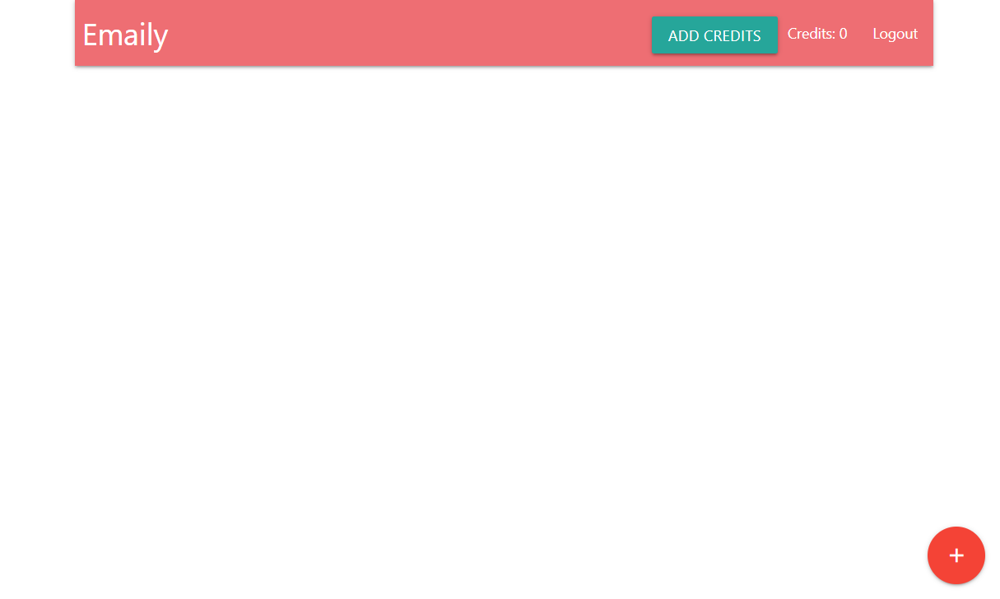
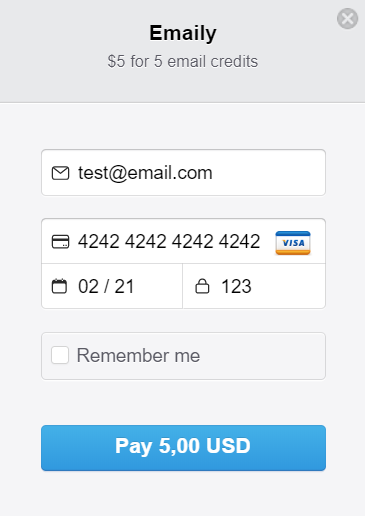
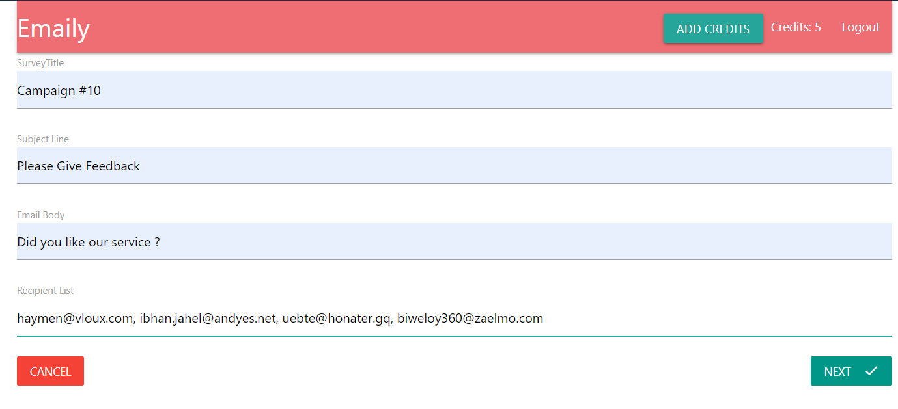
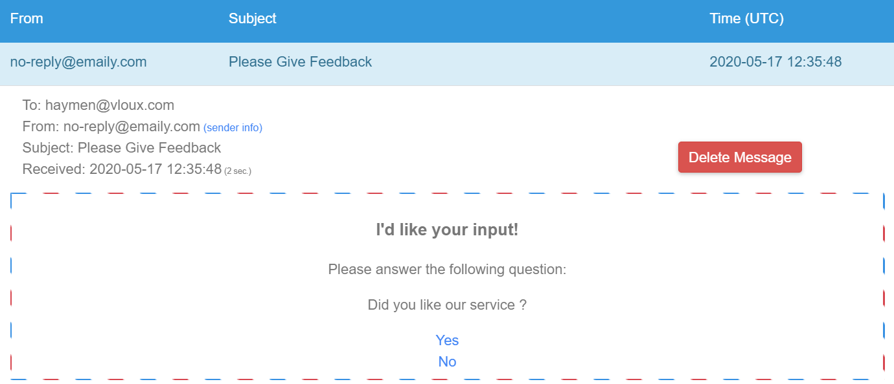
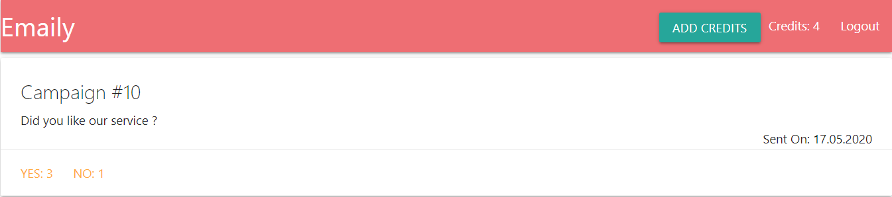

# Emaily
App for sending emails to customers and asking them for feedback about webpage.

## Table of contents
* [General info](#general-info)
* [Technologies](#technologies)
* [Features](#features)
* [Try out](#try-out)
* [How to use](#how-to-use)
* [Sources](#sources)

## General info

This is full-stack app  based on MERN stack.

## Technologies
For front-end
* React
* Redux

For back-end
* NodeJS with Express
* MongoDB with mongoose

## Features
* Authorization with Google OAuth
* Payments with Stripe 
* Emails with SendGrid
* Cloud database in MongoDB Atlas

## Try out
App online on heroku
https://calm-waters-56067.herokuapp.com/

## How to use
* To use app, you need to Login with Google.

* To create survey you need credits. Payments are in testing version. Use 4242 4242 4242 4242 card number, valid email, expiration date and any CVV number.  

  

* Create new survey by pressing + button. Email adresses of your clients, must be separated by commas.

* Confirm survey data and send it.

* Your clients will get emails like this

* After receiving feedback from your clients, you will get report.

## Sources
This app is based on Node with React: Fullstack Web Development Tutorial by Stephen Grider on Udemy.    
https://www.udemy.com/course/node-with-react-fullstack-web-development/learn/lecture/7607696#overview
